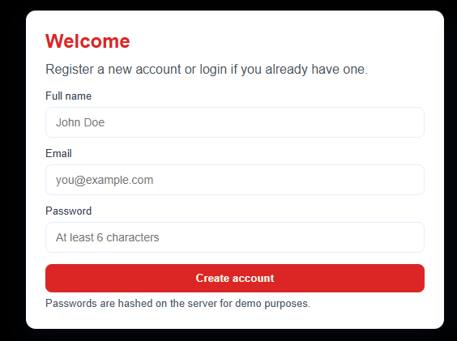
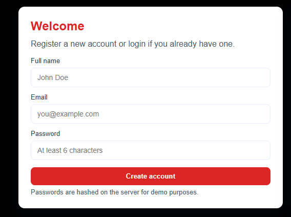

# 🔐 Simple Auth System

A basic user authentication system with email and password login.  
This project demonstrates a simple backend for login functionality, built with Node.js and Express.

---

## 🚀 Features

- User login using email and password
- Simple validation and feedback messages
- Styled frontend with responsive design
- Easily extendable for database integration
- Professional dark-themed UI with red buttons

---

## 🎨 Demo Screenshot

  

> Replace `screenshot.png` with your actual screenshot of the app.

---

## 💻 How to Use

1. Clone the repository:

```bash
git clone https://github.com/sc-carlyn/simple-auth-api.git
cd simple-auth-api

2️. Install Dependencies:

npm install

3️. Start the Server:

node server.js

4. Open your browser and navigate to:

http://localhost:3000
Enter your email and password to log in.

Example: email@example.com / password123

---

## ⚙️ **Technologies Used**

- Node.js
- Express
- HTML & CSS
- JavaScript
- JSON (for storing users temporarily)

---

## 📂 **File Structure**

simple-auth-api/
├── server.js
├── index.html
├── style.css
├── users.json
├── package.json
└── README.md

---

## 🤝 **Contribution**

Feel free to fork this project, improve the authentication logic, add database integration, or enhance the UI. Pull requests are welcome!

---

## 📝 **License**

This project is licensed under the MIT License.
